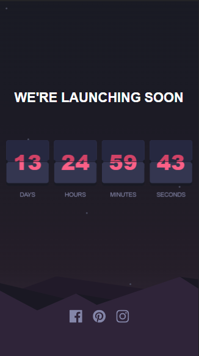

# Frontend Mentor - Launch countdown timer solution

This is a solution to the [Launch countdown timer challenge on Frontend Mentor](https://www.frontendmentor.io/challenges/launch-countdown-timer-N0XkGfyz-). Frontend Mentor challenges help you improve your coding skills by building realistic projects.

## Table of contents

- [Overview](#overview)
  - [The challenge](#the-challenge)
  - [Screenshot](#screenshot)
  - [Links](#links)
- [My process](#my-process)
  - [Built with](#built-with)
  - [What I learned](#what-i-learned)
- [Author](#author)

## Overview

### The challenge

Users should be able to:

- See hover states for all interactive elements on the page
- See a live countdown timer that ticks down every second
- When a number changes, make the card flip from the middle

### Screenshot

#### Desktop desing

#### Movile design

### Links

- Solution URL: [Github solution](https://github.com/DF27ARTS/Launch_count_down_challenge)
- Live Site URL: [Live site](https://df27arts.github.io/Launch_count_down_challenge)

## My process

### Built with

- Semantic HTML5 markup
- CSS custom properties
- Flexbox
- CSS Grid
- SASS Preprocessor
- Javascript

### What I learned

This project was particularly challenging. The flip animation looks a lot easier than it actually is, but I learned a lot by doing it and enjoyed the process a lot.

## Author

- Website - [Fernando Rojas](https://portfoliio-three.vercel.app/)
- Frontend Mentor - [@DF27ARTS](https://www.frontendmentor.io/profile/DF27ARTS)
- Twitter - [@\_DF_Fernando](https://twitter.com/_DF_Fernando)
